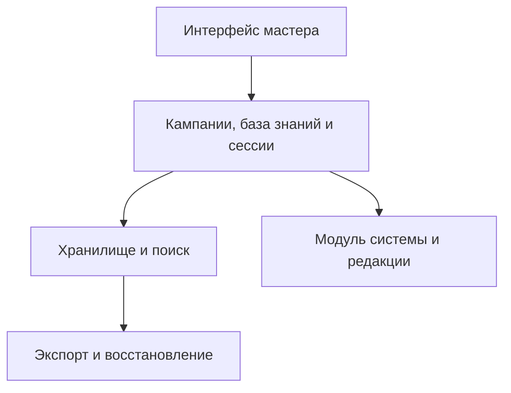

# Архитектурные принципы

Статус: предложение; платформа, стек и формат хранения ещё не выбраны.

## Общая часть и игровые правила

Общая часть отвечает за кампании, записи базы знаний, связи, теги, сессии и поиск. Ей не нужно знать, что такое класс брони или ячейка заклинания.

Модуль игровой системы описывает дополнительные поля и операции, зависящие от системы и редакции. Вначале достаточно одного встроенного модуля D&D. Отдельный магазин расширений или универсальный язык описания правил на этом этапе не нужен.

## Начальная модель данных

| Сущность | Назначение и основные поля |
| --- | --- |
| Campaign | ID, название, описание, язык, идентификаторы системы и редакции |
| Entry | ID, кампания, тип, название, текст, теги, время создания и изменения |
| EntryLink | Исходная запись, целевая запись, необязательный тип связи |
| Session | ID, кампания, название, дата, статус, итоговый отчёт |
| Scene | ID, сессия, порядок, название, заметки, ссылки на записи |
| JournalEvent | ID, сессия, время, текст, ссылки на записи |
| Encounter | ID, сессия, название, статус, раунд, текущий участник |
| Combatant | ID, бой, необязательная ссылка на запись, имя, инициатива, порядок при равенстве, текущее и максимальное здоровье, текстовые состояния |
| SystemData | Данные сущности для выбранного модуля правил и версия их схемы |

Персонажи и места начинаются как типы `Entry`. Отдельные сущности появляются, когда нужны собственное поведение и ограничения. Связи используют стабильные ID, чтобы переименование записи не ломало ссылки.

В первой версии записи принадлежат одной кампании. Общую библиотеку между кампаниями добавляем позже, когда станет понятен сценарий переиспользования.

## Поведение простого трекера боя

Порядок ходов задаётся инициативой; при равных значениях мастер выбирает порядок вручную. Переход хода и раунда, изменение здоровья и отметок сохраняются. Мастер может исправить ошибку ввода и восстановить предыдущего активного участника. Удаление активного участника должно оставлять определённый следующий ход. Бой можно закрыть и продолжить после перезапуска; итог записывается в журнал сессии.

## Сохранение и целостность

- Изменения сохраняются с понятным пользователю статусом и сообщением об ошибке.
- Закрытие или перезагрузка приложения не теряет подтверждённые изменения.
- Удаление связанной записи обрабатывается явно: предупреждение и согласованное поведение ссылок.
- Связи между разными кампаниями в первой версии запрещены.
- Экспорт содержит версию формата, сущности и связи. Импорт проверяет целостность и не перезаписывает существующие данные молча.
- Первая версия поддерживает текстовые материалы. Вложения добавляются вместе с правилами хранения и включения в резервную копию.

## Выбор платформы

Компьютер и телефон одинаково важны. Предлагаем адаптивное веб-приложение с возможностью последующего оформления как PWA. Это направление для обсуждения, а не окончательный выбор стека.

Нужно уточнить, должны ли одни и те же данные сразу быть доступны на обоих устройствах и обязательна ли работа без интернета. Если нужна общая кампания на устройствах, авторизация и синхронизация становятся частью базового сценария. Если нужен офлайн, заранее определяем поведение конфликтующих изменений. До этих ответов не обещаем ни синхронизацию, ни офлайн-режим.

До этого не закрепляем конкретные фреймворки, провайдера облака и базу данных. Начальная реализация предполагается как одно приложение с ясными границами модулей; разделение на сервисы сейчас не требуется.

## Расширения

Для материалов правил предусматриваем указание источника и редакции. Наполнение справочника и допустимые источники обсуждаются отдельно; план не предполагает готовой встроенной библиотеки книг.

Если появится доступ игроков, разрешения должны проверяться при чтении данных и экспорте, а не только скрывать элементы интерфейса. Пока приложение проектируется для одного мастера.

Если появится ИИ, сохраняем возможность обычной работы без него. Ответы по базе знаний должны ссылаться на исходные записи; изменение канона кампании требует действия мастера.
