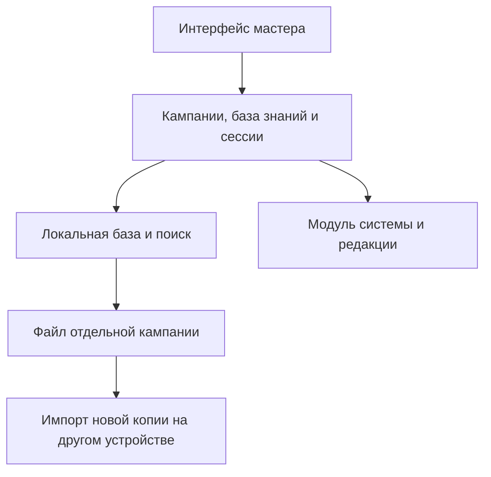

# Архитектурные принципы

Статус: архитектурное предложение после исследования. Офлайн и несколько кампаний подтверждены; PWA с IndexedDB и файловым экспортом предлагается проверить прототипом. [ADR 0001](adr/0001-offline-campaigns.md).

## Общая часть и игровые правила

Общая часть отвечает за кампании, записи базы знаний, связи, теги, сессии и поиск. Ей не нужно знать, что такое класс брони или ячейка заклинания.

Модуль игровой системы описывает дополнительные поля и операции, зависящие от системы и редакции. Первый встроенный модуль — D&D 5.5e (правила 2024 года), с фиксируемой версией источника SRD 5.2.1. [Проверка актуальности](research/tools-comparison.md). Отдельный магазин расширений или универсальный язык описания правил на этом этапе не нужен.

## Начальная модель данных

| Сущность | Назначение и основные поля |
| --- | --- |
| Campaign | ID, название, описание, язык, система и её версия, версия SRD, статус архива, время изменения |
| Entry | ID, кампания, тип, название, текст, теги, статус зацепки при необходимости, время создания и изменения |
| EntryLink | Исходная запись, целевая запись, необязательный тип связи |
| Session | ID, кампания, название, дата, статус, итоговый отчёт |
| Scene | ID, сессия, порядок, название, заметки, ссылки на записи |
| JournalEvent | ID, сессия, время, текст, ссылки на записи |
| Encounter | ID, сессия, название, статус, раунд, текущий участник |
| Combatant | ID, бой, ссылка на исходную запись и снимок её боевых данных, имя, инициатива, порядок при равенстве, текущее/максимальное/временное здоровье, состояния и концентрация |
| SystemData | Данные сущности для выбранного модуля правил и версия их схемы |

Персонажи и места начинаются как типы `Entry`. Отдельные сущности появляются, когда нужны собственное поведение и ограничения. Связи используют стабильные ID, чтобы переименование записи не ломало ссылки.

Можно хранить несколько независимых кампаний. Записи принадлежат одной кампании; сессии, журнал и бои также изолированы её ID. Архивирование скрывает кампанию из основного списка без удаления; архив можно открыть и восстановить. Общую библиотеку между кампаниями добавляем позже, когда станет понятен сценарий переиспользования.

## Поведение простого трекера боя

Порядок ходов задаётся инициативой; при равных значениях мастер выбирает порядок вручную. Переход хода и раунда, изменение здоровья и отметок сохраняются. Мастер может отменить последнее изменение и восстановить предыдущего активного участника. Кнопка предыдущего хода меняет позицию в очереди, а отмена откатывает конкретное действие; это разные операции. Снимок состояния и ограниченная история для отмены сохраняются одной транзакцией. Удаление активного участника должно оставлять определённый следующий ход. Бой можно закрыть и продолжить после перезапуска; итог записывается в журнал сессии.

Участник боя получает собственный ID и копию нужных боевых данных; изменение его здоровья не меняет исходную запись или других участников. Боевая логика реализуется отдельно от интерфейса как операции над состоянием. Это наш проектный вывод из [исследования реализаций](research/tools-comparison.md).

## Сохранение и целостность

- Изменения сохраняются локально с понятным статусом и сообщением об ошибке. Подтверждение сохранения выдаётся после завершения транзакции.
- Закрытие или перезагрузка приложения не теряет подтверждённые изменения.
- Удаление связанной записи обрабатывается явно: предупреждение и согласованное поведение ссылок.
- Связи между разными кампаниями в первой версии запрещены.
- Экспорт каждой кампании содержит версию формата, сущности, связи и текущее состояние боя. Импорт проверяет целостность и создаёт новую независимую кампанию с переназначением ID; существующие данные не перезаписываются. Повторный импорт — ещё одна явно обозначенная копия. Формат и проверки описаны в [ADR 0001](adr/0001-offline-campaigns.md).
- Поиск, обратные ссылки, создание кампаний и ведение боя работают без сети. Ссылки из сцен и журнала участвуют в обратных ссылках на записи.
- Первая версия поддерживает текстовые материалы. Вложения добавляются вместе с правилами хранения и включения в резервную копию.

## Выбор платформы

Рекомендуемый первый прототип — адаптивная PWA. IndexedDB хранит кампании, service worker кеширует интерфейс; первоначальная загрузка требует сети. Обязательные файлы, шрифты и иконки входят в приложение. Сервер кампаний, аккаунты и синхронизация не нужны. [Техническое обоснование и альтернативы](adr/0001-offline-campaigns.md).

Локальное автосохранение и внешняя резервная копия — разные функции. Экспорт переносит кампанию файлом между устройствами. Импортированные копии дальше независимы; приложение не объединяет их автоматически.

Кеширование интерфейса не гарантирует сохранность базы. Проверяем запрос постоянного хранения, отказ в записи и восстановление из файла. Обновление приложения не должно прерывать бой, а изменение схемы — уничтожать данные. Проверка на реальном компьютере и телефоне предшествует окончательному принятию платформы.

Конкретные библиотеки выбираем при создании прототипа. Слой хранения отделён от предметной модели, чтобы при необходимости заменить браузерную базу в устанавливаемой оболочке. Начальная реализация остаётся одним приложением с ясными границами модулей.

## Расширения

Для материалов правил предусматриваем указание источника и редакции. Наполнение справочника и допустимые источники обсуждаются отдельно; план не предполагает готовой встроенной библиотеки книг.

Если появится доступ игроков, разрешения должны проверяться при чтении данных и экспорте, а не только скрывать элементы интерфейса. Пока приложение проектируется для одного мастера.

Если появится ИИ, сохраняем возможность обычной работы без него. Ответы по базе знаний должны ссылаться на исходные записи; изменение канона кампании требует действия мастера.
